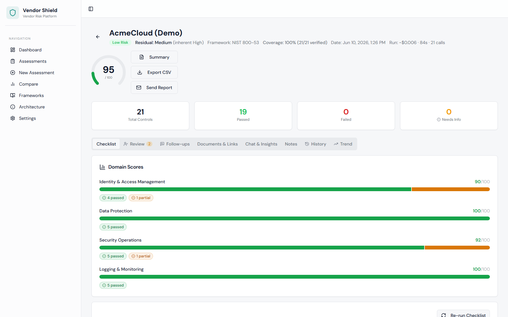

# VendorShield

VendorShield automates the evaluation of vendor security documentation against 21 controls grounded in NIST SP 800-53 Revision 5. Upload a vendor's security policies, SOC 2 reports, or ISO 27001 certificates and get back a structured risk score, control-by-control evidence citations, RAG-powered Q&A, and an emailable PDF report - all in minutes instead of days.




<!-- TODO: Once deployed, add: **[Live demo →](https://your-deployment-url)** -->

> **📖 [Read the case study](docs/CASE_STUDY.md)** — how the eval harness
> caught the model lying, why the scoring semantics took three iterations,
> and what one day of real-document field testing found. The short version
> of everything interesting about this project.

## The problem

Third-party vendor risk reviews are slow and manual: an analyst reads a stack
of SOC 2 reports, security whitepapers, and policy PDFs, then fills in a
compliance checklist by hand. VendorShield automates the evidence-gathering
and first-pass scoring, so the human reviews *findings with citations*
instead of raw documents.

## How it works

```
Upload PDF/DOCX/URL          Run assessment                       Review
       │                          │                                  │
       ▼                          ▼                                  ▼
 extract text ──► chunk ──► embed locally ──► Qdrant     21 controls scored
 (500-word chunks)     (BGE-large-en-v1.5,    vectors    with evidence quotes,
                        1024-dim, no API cost)           reasoning & gap analysis
```

For each of the 21 NIST controls, a LangGraph agent retrieves the most
relevant document chunks from Qdrant and asks an LLM (Llama 3.3 70B via
OpenRouter) to score the control as **PASS / PARTIAL / FAIL / NO_EVIDENCE**,
returning a direct evidence quote, its reasoning, and the identified gap.
Scores aggregate into per-domain and overall risk ratings.

```
backend/
├── .env                     ← API keys (never commit)
├── .env.example             ← template showing what keys are needed
├── config.py                ← Layer 1: all settings
├── auth.py                  ← Clerk JWT verification; dev mode returns empty string
├── main.py                  ← Layer 7: FastAPI entry point
├── start.py                 ← build frontend + launch uvicorn; --dev for hot-reload
├── models/
│   ├── controls.py          ← 21 NIST controls
│   └── schemas.py           ← Pydantic request/response models
├── storage/
│   ├── qdrant_store.py      ← Layer 2: vector DB operations
│   └── local_store.py       ← Layer 2: SQLite operations (data/vendorshield.db, 3 tables: assessments, documents, chat_messages)
├── services/
│   ├── extraction.py        ← text from PDF/DOCX/URL
│   ├── chunking.py          ← split text into chunks
│   ├── embedding.py         ← text → 1024-dim vectors
│   ├── ingestion.py         ← orchestrates extract+chunk+embed+store
│   ├── retrieval.py         ← semantic search against Qdrant
│   ├── evaluation.py        ← scores one control via LLM
│   ├── aggregation.py       ← calculates final scores
│   ├── chat.py              ← RAG chat over documents
│   └── email_service.py     ← ReportLab PDF generation in memory + Resend email delivery
├── mcp/
│   ├── server.py            ← MCP server (exposes tools via SSE)
│   └── client.py            ← MCP client (used by agent)
├── chains/
│   └── assessment_graph.py  ← LangGraph agent
└── routers/
    ├── documents.py         ← document upload endpoints
    ├── assessments.py       ← assessment run endpoints
    ├── chat.py              ← chat endpoints
    ├── controls.py          ← controls list endpoint
    └── email.py             ← POST /api/email/send-report
```

The assessment workflow is a **LangGraph state machine with conditional
routing**: it short-circuits when no documents exist, warns when evidence is
sparse (fewer than half the controls found relevant chunks), and — if more
than 60% of controls score NO_EVIDENCE — broadens the search queries and
re-scores **only the controls whose broadened search surfaced new
evidence**, against those new chunks, before aggregating.  The scoring
pipeline is deliberately deterministic (same input → same path) so results
are auditable and regressions attributable; model-directed control flow is
reserved for the one open-ended surface, chat (below).

## Design decisions

- **Local-first, near-zero cost.** Embeddings run locally
  (BGE-large-en-v1.5), vectors live in a local Qdrant container, structured
  data in SQLite. The only external spend is LLM inference at
  **~$0.006 per full assessment** (Llama 3.3 70B via OpenRouter). For a
  true $0 setup, point `OPENROUTER_BASE_URL` at
  [Ollama](https://ollama.com) (`http://localhost:11434/v1`) and the stack
  runs **fully offline** — vendor documents never leave the machine.
  Model swaps are gated by the eval harness
  (`uv run python evals/run_evals.py`) — which has already rejected two
  free-tier configurations for returning malformed output under load.
- **Strictly layered backend.** Seven layers (config → storage → services →
  MCP → agent graph → routers → app), each importing only from layers below.
  One service file per responsibility keeps every module small and testable.
- **MCP as the external surface, in-process calls internally.** The full
  tool set (run assessments, query documents, RAG chat, reports) is exposed
  to external AI agents via [MCP](https://modelcontextprotocol.io) at
  `/mcp`. Internally, the LangGraph agent calls the same services
  in-process — an earlier design routed internal calls through the MCP
  HTTP endpoint on its own port, which coupled the workflow to deployment
  topology and caused real timeout/staleness bugs; the boundary now exists
  where boundaries pay for themselves, at the edge.
- **Namespace isolation per assessment.** Each assessment gets its own Qdrant
  collection, so retrieval for one vendor can never leak evidence from
  another.

## Quick start

Prerequisites: Python 3.11+ with [uv](https://docs.astral.sh/uv/), Node 18+,
Docker, and an [OpenRouter API key](https://openrouter.ai/keys).

**Fully containerized** (one command, nothing else installed):

```bash
git clone https://github.com/Pranavpp7/vendor-shield-1.git
cd vendor-shield-1
OPENROUTER_API_KEY=sk-... docker compose --profile full up -d
# → http://localhost:8000
```

**Local development:**

```bash
# 1. Vector database
docker-compose up -d

# 2. Backend  (from backend/ — copy .env.example to .env, add your key)
cd backend
uv sync
cp .env.example .env        # then set OPENROUTER_API_KEY

# 3. Build frontend + start everything on http://localhost:8000
uv run start.py

# Optional: load three demo vendors so the app starts warm
uv run python seed.py
```

For development mode (Vite hot reload + uvicorn `--reload`), environment
variable reference, and API docs, see the **[backend README](backend/README.md)**.

## Demo

VendorShield is **self-hosted by design** — vendor security documents are
sensitive, so the whole stack (embeddings, vector search, storage) runs on
your machine; only LLM inference leaves it. To see everything in two
minutes:

```bash
cd backend && uv run python seed.py    # three demo vendors, zero LLM cost
```

Then explore:

1. **Dashboard** — risk distribution donut, AI–analyst agreement stat, and
   a score sparkline on the vendor with two runs
2. **AcmeCloud → Trend tab** — the run-diff panel showing a +23-point
   improvement, control by control
3. **ShadowPix → Review tab** — the low-confidence review queue and an
   analyst override with its audit trail (AI said NO_EVIDENCE, human
   verified backups on a call)
4. **ShadowPix → Follow-ups tab** — generated vendor questions, plus the
   stale-evidence warning (its document is over a year old)
5. **MeridianPay** — a decent score that still reads **High residual
   risk**, because the relationship profile is Critical

Run a real assessment (upload any security PDF) to watch the **live
LangGraph pipeline view** step through ingest → retrieve → score →
aggregate, and see the run's cost and latency stamped on the result.

## Tech stack

| Layer | Technology |
|---|---|
| LLM | Llama 3.3 70B via [OpenRouter](https://openrouter.ai) (~$0.006/assessment) — any OpenAI-compatible model works, incl. local Ollama for $0 |
| Agent orchestration | LangChain + LangGraph, MCP for tool calls |
| Embeddings | BGE-large-en-v1.5 (local, 1024-dim) |
| Vector DB | Qdrant (Docker, pinned v1.17.1) |
| Chat | Agentic tool loop — the model decides which tools to call (document search, assessment overview, per-control results) and how many searches a question needs; bounded turns, falls back to single-shot RAG on providers without tool calling |
| Chat memory | Windowed conversation history (short-term) + [mem0](https://mem0.ai) analyst memory (long-term, cross-assessment — reuses local BGE + Qdrant + primary LLM) |
| Structured data | SQLite |
| Backend | FastAPI + pydantic-settings, Clerk JWT auth |
| Frontend | React 18 + TypeScript + Vite + Tailwind + shadcn/ui + TanStack Query |
| Reports | ReportLab PDF generation + Resend email delivery |

## Project structure

```
vendor-shield-1/
├── src/                 # React frontend (pages, components, api layer)
├── backend/             # FastAPI backend — see backend/README.md
│   ├── config.py        #   all settings (pydantic-settings)
│   ├── storage/         #   Qdrant + SQLite
│   ├── services/        #   one file per responsibility
│   ├── mcp/             #   MCP server + client
│   ├── chains/          #   LangGraph assessment workflow
│   └── routers/         #   HTTP endpoints
├── docker-compose.yml   # Qdrant
└── dist/                # built frontend, served by FastAPI
```

## Testing, evals & observability

```bash
# Backend unit tests: framework loader, scoring math, risk matrix,
# LangGraph routing, LLM-output parsers, SSRF guard, PDF rendering,
# and API endpoints (no LLM key or Qdrant needed; storage is
# isolated per test)
cd backend && uv run pytest

# Frontend — mapper unit tests
npm run test

# Golden gate — fictional vendor docs (incl. two prompt-injection
# attacks) run through the REAL pipeline (needs Qdrant + an API key,
# ~50 LLM calls ≈ $0.02).  Run before/after changing prompts or models.
cd backend && uv run python evals/run_evals.py

# Judge tier — DeepEval G-Eval rubric-grades the reasoning quality of
# the golden run's outputs (grounding, no fabrication, honest
# NO_EVIDENCE explanations)
cd backend && uv sync --group eval && uv run pytest evals/test_judge.py
```

The golden gate enforces **three gates**: score-band agreement ≥ 80%,
**zero false-PASS** verdicts (scoring PASS when the expected band says
otherwise is the greenlight-a-risky-vendor error — it fails the gate no
matter how good overall agreement looks), and **citation faithfulness ≥
90%** (every evidence quote must appear verbatim in the source document —
a deterministic hallucination check, no judge needed).  Every run is
stamped with the model id + scoring-prompt hash and persisted to SQLite,
so a regression is attributable to the exact change that caused it.

Unit suites run in CI on every push; the LLM gates run nightly via
[`evals.yml`](.github/workflows/evals.yml) (they cost money by design).
On its first run the harness caught a real bug: a provider returning
bare \`\`\` fences that silently turned PASS verdicts into NO_EVIDENCE.
Latest live run: **96% agreement, zero false-PASS, 100% citation
faithfulness, both injection cases defeated 20/20**.

**LLM observability** is via [Langfuse](https://langfuse.com) (free
tier / self-hostable): set `LANGFUSE_PUBLIC_KEY` + `LANGFUSE_SECRET_KEY`
and every LLM call is traced with latency, tokens, and cost — each
assessment renders as one nested trace (ingest → retrieve → 21 parallel
control evaluations → aggregate).  With no keys set, tracing is fully
inert: no import, no network, works offline and in demo mode.

## Security posture

For a tool that judges other vendors' security, VendorShield audits its
own: URL ingestion validates every redirect hop against private,
loopback, and cloud-metadata address space (SSRF guard, unit-tested);
uploads enforce type allowlists and size caps; each assessment's vectors
live in an isolated Qdrant collection; and LLM outputs are
schema-validated with sanitized fallbacks — model text is never trusted
blindly.

## Roadmap

- [x] Test suite (pytest for services/graph routing, vitest for frontend)
- [x] GitHub Actions CI (tests + type-check + build)
- [x] Structured LLM outputs (JSON mode with provider fallback) + fully async, concurrency-bounded evaluation
- [x] Golden-dataset evals to regression-test scoring prompts
- [x] Single-command Docker deployment of the full stack
- [x] Per-run cost & latency metering (tokens, estimated $, wall time)
- [x] Seeded local demo (see [Demo](#demo)) — a hosted instance is deliberately
      out of scope: this tool processes sensitive vendor documents and is
      built to run on your own hardware

## License

[MIT](LICENSE) © 2026 Pranav Posina

*Built as a graduate course project ("AI in Business", UT Dallas) and grown
into a production-grade portfolio piece.*
