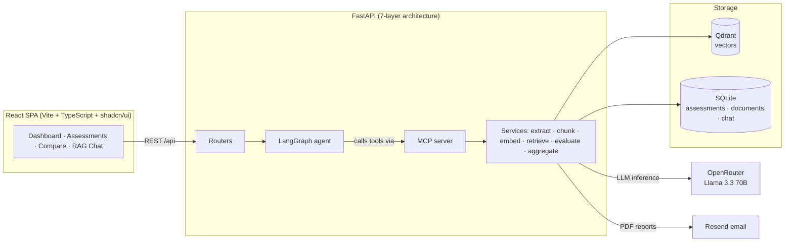

# VendorShield

**AI-powered vendor security risk assessment.** Upload a vendor's security
documentation, and VendorShield scores it against 20 controls from
NIST SP 800-53 Rev. 5 using retrieval-augmented generation — with cited
evidence for every score, a RAG chatbot for follow-up questions, and
email-ready PDF reports.


<!--
  TODO: Add a screenshot or demo GIF here. Suggested:
    1. Run the app, open the Assessment Detail page for a completed assessment
    2. Save the capture to docs/screenshot.png
    3. Uncomment:
  

  TODO: Once deployed, add: **[Live demo →](https://your-deployment-url)**
-->

## The problem

Third-party vendor risk reviews are slow and manual: an analyst reads a stack
of SOC 2 reports, security whitepapers, and policy PDFs, then fills in a
compliance checklist by hand. VendorShield automates the evidence-gathering
and first-pass scoring, so the human reviews *findings with citations*
instead of raw documents.

## How it works

```
Upload PDF/DOCX/URL          Run assessment                       Review
       │                          │                                  │
       ▼                          ▼                                  ▼
 extract text ──► chunk ──► embed locally ──► Qdrant     20 controls scored
 (500-word chunks)     (BGE-large-en-v1.5,    vectors    with evidence quotes,
                        1024-dim, no API cost)           reasoning & gap analysis
```

For each of the 20 NIST controls, a LangGraph agent retrieves the most
relevant document chunks from Qdrant and asks an LLM (Llama 3.3 70B via
OpenRouter) to score the control as **PASS / PARTIAL / FAIL / NO_EVIDENCE**,
returning a direct evidence quote, its reasoning, and the identified gap.
Scores aggregate into per-domain and overall risk ratings.

### Architecture



The assessment workflow is a **LangGraph state machine with conditional
routing**: it short-circuits when no documents exist, warns when evidence is
sparse (fewer than half the controls found relevant chunks), and — if more
than 60% of controls score NO_EVIDENCE — broadens the search queries and
retries evaluation once before aggregating.

## Design decisions

- **Local-first, near-zero cost.** Embeddings run locally
  (BGE-large-en-v1.5), vectors live in a local Qdrant container, structured
  data in SQLite. The only external paid service is LLM inference — and the
  frontend is served by FastAPI itself, so the whole app is one process plus
  one container.
- **Strictly layered backend.** Seven layers (config → storage → services →
  MCP → agent graph → routers → app), each importing only from layers below.
  One service file per responsibility keeps every module small and testable.
- **MCP as the tool boundary.** The LangGraph agent doesn't import services
  directly — it calls them as [MCP](https://modelcontextprotocol.io) tools.
  The same tool surface that powers the internal agent is exposed to external
  AI agents at `/mcp`.
- **Namespace isolation per assessment.** Each assessment gets its own Qdrant
  collection, so retrieval for one vendor can never leak evidence from
  another.

## Quick start

Prerequisites: Python 3.11+ with [uv](https://docs.astral.sh/uv/), Node 18+,
Docker, and an [OpenRouter API key](https://openrouter.ai/keys).

```bash
git clone https://github.com/Pranavpp7/vendor-shield-1.git
cd vendor-shield-1

# 1. Vector database
docker-compose up -d

# 2. Backend  (from backend/ — copy .env.example to .env, add your key)
cd backend
uv sync
cp .env.example .env        # then set OPENROUTER_API_KEY

# 3. Build frontend + start everything on http://localhost:8000
uv run start.py
```

For development mode (Vite hot reload + uvicorn `--reload`), environment
variable reference, and API docs, see the **[backend README](backend/README.md)**.

## Tech stack

| Layer | Technology |
|---|---|
| LLM | Llama 3.3 70B via [OpenRouter](https://openrouter.ai) (OpenAI-compatible API) |
| Agent orchestration | LangChain + LangGraph, MCP for tool calls |
| Embeddings | BGE-large-en-v1.5 (local, 1024-dim) |
| Vector DB | Qdrant (Docker, pinned v1.17.1) |
| Structured data | SQLite |
| Backend | FastAPI + pydantic-settings, Clerk JWT auth |
| Frontend | React 18 + TypeScript + Vite + Tailwind + shadcn/ui + TanStack Query |
| Reports | ReportLab PDF generation + Resend email delivery |

## Project structure

```
vendor-shield-1/
├── src/                 # React frontend (pages, components, api layer)
├── backend/             # FastAPI backend — see backend/README.md
│   ├── config.py        #   all settings (pydantic-settings)
│   ├── storage/         #   Qdrant + SQLite
│   ├── services/        #   one file per responsibility
│   ├── mcp/             #   MCP server + client
│   ├── chains/          #   LangGraph assessment workflow
│   └── routers/         #   HTTP endpoints
├── docker-compose.yml   # Qdrant
└── dist/                # built frontend, served by FastAPI
```

## Roadmap

- [ ] Test suite (pytest for services/graph routing, vitest for frontend)
- [ ] GitHub Actions CI (lint + tests + build)
- [ ] Single-command Docker deployment of the full stack + live demo
- [ ] Structured-output enforcement for LLM scoring responses
- [ ] Golden-dataset evals to regression-test scoring prompts

## License

[MIT](LICENSE) © 2026 Pranav Posina

*Built as a graduate course project ("AI in Business", UT Dallas) and grown
into a production-grade portfolio piece.*
